# LeRobot SO\-ARM101机械臂使用文档\-v0\.3

## 声明

本文档为官方文档的补充，非替代。我们尽量保持与最新代码的同步，遇到问题时，优先参考：

[Lerobot关于so\-101的官方指引](https://huggingface.co/docs/lerobot/so101)。


[真机采集数据、训练参考koch](https://huggingface.co/docs/lerobot/main/en/getting_started_real_world_robot?teleoperate_koch_camera=Command)


**特别注意事项：**

**！！舵机切勿长时间大负载工作，特别是长时间堵转，或者持续用力夹持木块石头等硬物，容易造成舵机温度过高甚至烧坏。！！**

**遇到以下情况时，第一时间把电源适配器断开，以免对舵机造成不可逆的损坏。**

1. **舵机闪红灯时**

2. **某个关节被物理位置卡死时**


硬件套装可在本公司官方销售渠道下单购买：

[https://item.taobao.com/item.htm?spm=a21dvs.23580594.0.0.67812c1bFsxNwh&ft=t&id=887529352123]()


## **环境与硬件准备**

### 软件环境配置

- **安装Miniconda**（推荐Python 3\.10）：  

    ```Bash
    wget https://repo.anaconda.com/miniconda/Miniconda3-latest-Linux-x86_64.sh
    sh Miniconda3-latest-Linux-x86_64.sh
    source ~/.bashrc
    ```

    - 对于Windows

        - 可以去官方网站下载：https://www\.anaconda\.com/download/

        - 也可以安装之前下载的这个版本 24\.9\.2

也可以从 [Miniconda 官方下载页](https://www\.anaconda\.com/download/) 下载 Windows 安装程序。

安装 anaconda 之后，Windows平台建议使用 Anaconda Powershell Prompt 执行终端命令（不要使用 cmd\.exe，很多命令的解析规则不一样）

- **创建虚拟环境**：  

    ```Shell
    **conda create -n lerobot python=3.10**
    **conda activate lerobot**
    ```

后续再次进入环境，只需要执行 “conda activate lerobot” 就可以了

- **克隆代码库**：  

    注意克隆保存的路径，不要有中文字符，否则可能导致运行时找不到 python 库的路径。

    由于 lerobot 的官方代码仓库更新很频繁且非常随意，为了保持教程和代码的一致性，带给大家更好的体验，建议优先下载同步我们的仓库。本文档匹配 lerobot\-v0\.3 版本

    ```Shell
    **git clone ****https://github.com/JoyandAI/lerobot****.git**
    git checkout 099af72601b39cc6b0752b96737f62c03bbca776
    ```

    需要体验官方最新的代码特性，则克隆官方的仓库，虽然我们尽量保持更新，但不保证本教程和官方最新代码同步。

    git clone https://github\.com/huggingface/lerobot\.git

- **进入到lerobot目录，安装lerobot的依赖包并且指定添加飞特舵机相关的驱动**

```Shell
cd lerobot
pip install -e ".[feetech]"
```

- **安装ffmpeg（建议7\.1\.1，支持 libsvtav1编码）**

    ```Shell
    conda install -c conda-forge ffmpeg=7.1.1
    ```

#### 没有VPN怎么办？

##### 代码克隆

中国大陆 github连接不稳定，多试几次，一旦连接上，大概率就能克隆成功。


##### ubuntu软件源设置

建议切换成国内阿里云的软件镜像，参考[Ubuntu更换阿里云软件源](https://developer.aliyun.com/article/704603)


##### python包安装

python的软件源也可以切换成国内的源，以减少pip安装软件包时的出错。

参考这里的教程：https://mirrors\.tuna\.tsinghua\.edu\.cn/help/pypi/


升级 pip 到最新的版本后进行配置：

```Shell
python -m pip install --upgrade pip
pip config set global.index-url https://mirrors.tuna.tsinghua.edu.cn/pypi/web/simple
```

如果您到 pip 默认源的网络连接较差，临时使用本镜像站来升级 pip：

```Shell
python -m pip install -i https://mirrors.tuna.tsinghua.edu.cn/pypi/web/simple --upgrade pip
```


### **硬件清单**  

#### **必购部件**：  

|部件|数量|备注|
|---|---|---|
|飞特STS3215舵机|12个|主臂/从臂各6个|
|舵机控制适配板|2块|主臂/从臂各1块|
|3D打印结构件|1套|也可以自己打印|
|广角摄像头|2个|分辨率≥720P|

#### **可选工具**：

十字螺丝刀，4mm粗的用于拧M3的机牙螺丝（舵盘固定螺丝），3mm粗的螺丝刀用于拧M2的自攻螺丝（舵机身固定螺丝）


~~锉刀（打磨打印件）  ~~


硅胶刮刀/硅胶棒，摩擦力大，用于辅助副舵盘的对位。（发现有更合适的工具，欢迎向大家推荐）


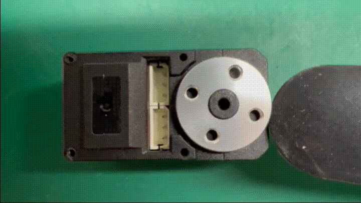


## **机械臂组装**

**已经组装好的成品，可以跳过这一步。**

### **硬件组装**

- **打印件处理**：如果发现有一些小的支撑未处理干净，可以用小刀刮干净，确保舵机安装无卡顿

- **单个臂安装顺序：先底部后末端。**

    - 底座1号 \-\-\>肩部旋转部件2号 \-\-\>大臂3号 \-\-\> 小臂4号 \-\-\> 腕部5号 \-\-\> 夹爪6号


对于Leader臂，为了示教操作更省力更丝滑，采用了不同的齿比。同时为了降低成本，Leader臂统一使用 7\.4V 的舵机。具体地：

||**Leader臂**<br>**统一为 7\.4V 舵机**|**Follower臂**|
|---|---|---|
|**7\.4V 标准扭矩版本**|1号舵机，STS3215\-C044，减速比 1:191<br>2号舵机，STS3215\-C001，减速比 1:345<br>3号舵机，STS3215\-C044，减速比 1:191<br>4号舵机，STS3215\-C046，减速比 1:147<br>5号舵机，STS3215\-C046，减速比 1:147<br>6号舵机，STS3215\-C046，减速比 1:147|6个 7\.4V 345齿比舵机，型号为 STS3215\-C001，减速比 1:345|
|**12V 大扭矩版本**<br>||6个 12V 345齿比舵机，型号为 STS3215\-C018<br>|

减速比在舵机上的位置

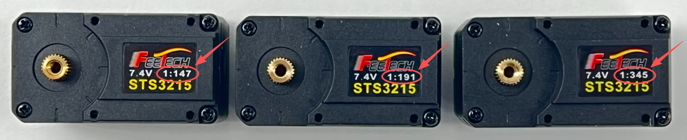

对于Leader臂，记得把正确型号的舵机装在相应的关节处。

舵机顺序与位置的对应关系（这里标号只是方便说明把指定型号的舵机安装在对的位置，还未编号）


#### 视频安装教程如下

[https://www.bilibili.com/video/BV18gG1z4EZu/]()

固定爪安装6号舵机前，**强烈建议先预埋两颗M3的螺母，避免后续安装相机支架时再拆开**

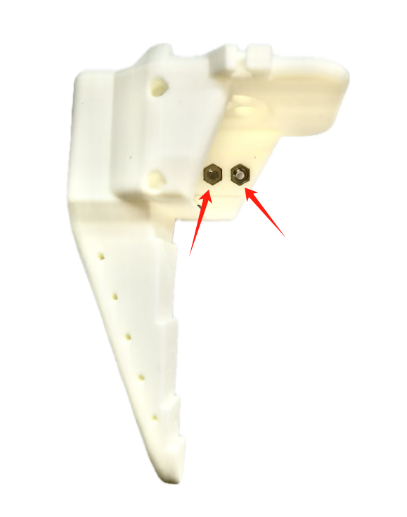

组装完成后，由于还未编号，每个舵机连一根线，预留出来，不要连接下一个舵机，待编号完成之后再全部连接起来。


### 安装固定和线路连接

在后续步骤操作前，安装固定到桌面有利于操作的稳定。

#### 固定到桌面

准备：

1. 排插，至少2个两插孔，如果考虑电脑，至少3插孔

2. 平整桌面，边缘厚度不超过5cm


用G字夹将安装好的机械臂底座，夹在桌面边缘。为了稳固，两边各夹一个G字夹。

为了不相互干扰，建议相隔50cm以上。


其他固定方式，比如螺丝固定，可以利用底座上的4个螺丝孔位，底座使用M4的螺栓。

#### **电路连接**

主臂/从臂舵机分别连接对应控制板，黑色USB线连黑色臂，白色USB线连白色臂，便于区分。


控制板上插上USB线的Type\-C端，USB线的另一端连接电脑USB插口（可以通过USB Hub连接）。

电源适配器的DC5\.5\*2\.1公头插在舵机控制板上，电源的插头插市电220V。


**连接电源时，需要特别注意：SO\-101的Leader臂统一使用 7\.4V 的舵机，而从臂因力矩的不同，可能有 7\.4V 和 12V 之分。使用 12V版本的一定注意区分电源适配器，在电源线输出端 DC5\.5\*2\.1公头处贴上标签，以免插错导致舵机过压损坏。**


**Leader臂接 7\.4V 2\~3A 或 5V 2A 的电源适配器**

### 确定舵机驱动板的端口号

拿一块舵机驱动板，连接USB线到电脑，电源适配器插入舵机驱动板电源口。


编号前需要查找驱动板端口号，find\_port\.py 通过插拔前后系统检测到的端口号的变化来判断你所拔掉设备的端口号。

在lerobot源码目录下执行脚本

```Plain Text
python -m lerobot.find_port
```

Linux系统可能输出如下

> Finding all available ports for the MotorsBus\.
> 
> Ports before disconnecting: \['/dev/ttyACM0', '/dev/ttyACM1'\]
> 
> Remove the USB cable from your MotorsBus and press Enter when done\.
> 
> The port of this MotorsBus is '/dev/ttyACM0'                \<\-\- 这个就是刚刚拔掉的设备的端口号
> 
> Reconnect the USB cable\.
> 
> 

Linux下，一般需要增加串口设备文件的读写权限 \(假如找到的端口号包含 /dev/ttyACM0 /dev/ttyACM1\)

```Bash
sudo chmod +666 /dev/ttyACM0 /dev/ttyACM1
```


Mac系统可能输出如下

> Finding all available ports for the MotorBus\.
> 
> \['/dev/tty\.usbmodem575E0032081', '/dev/tty\.usbmodem575E0031751'\]
> 
> Remove the USB cable from your MotorsBus and press Enter when done\.
> 
> \[\.\.\.Disconnect corresponding leader or follower arm and press Enter\.\.\.\]
> 
> The port of this MotorsBus is /dev/tty\.usbmodem575E0032081              \<\-\- 这个就是刚刚拔掉的设备的端口号
> 
> Reconnect the USB cable\.
> 
> 

Windows可能输出如下，说明当前连接的端口号是 COM7

> Finding all available ports for the MotorsBus\.
> 
> Ports before disconnecting: \['COM7', 'COM8'\]
> 
> Remove the USB cable from your MotorsBus and press Enter when done\.
> 
> The port of this MotorsBus is 'COM7'                \<\-\- 这个就是刚刚拔掉的设备的端口号
> 
> Reconnect the USB cable\.
> 
> 

### **编号**

**拿到组装成品的用户，跳过两个臂的编号这一步。！！！我们已经编好号，新手千万不要再编号，不要 不要 切记 ！！！可以跳过这一步**

#### 编号操作步骤演示视频和图片

先了解整个过程

（从末端电机开始编号，每编号一个才多连接一个电机）

由于舵机出厂时的编号都为1，请不要一开始就全部串联在一起，否则全部是1号，总线通信无法区分。

[设置电机编号\_so101\-组装连线之后设置\.mp4](图片和附件/设置电机编号_so101-组装连线之后设置.mp4)


执行脚本（再次确认，成品出厂的机械臂\!**不\!需要**再执行这里的脚本编号）

```Shell
python -m lerobot.setup_motors --robot.type=so101_follower --robot.port=**/dev/ttyACM0**
```

```Shell
python -m lerobot.setup_motors --robot.type=so101_follower --robot.port=**/dev/tty.usbmodem585A0076841**
```

```PowerShell
python -m lerobot.setup_motors --robot.type=so101_follower --robot.port=**COM3**
```


Leader臂编号，替换成 teleop 和 so101\_leader，以 Ubuntu 为例

```Shell
python -m lerobot.setup_motors --teleop.type=so101_leader --teleop.port=**/dev/ttyACM0**
```


脚本执行之后按下面的步骤逐个编号

|**步骤**|接线|**图示**|
|---|---|---|
|**6号舵机编号**|驱动板只接6号关节的舵机||
|**5号舵机编号**|驱动板只接5号关节的舵机||
|**4号舵机编号**|驱动板只接4号关节的舵机||
|**3号舵机编号**|驱动板只接3号关节的舵机||
|**2号舵机编号**|驱动板只接2号关节的舵机|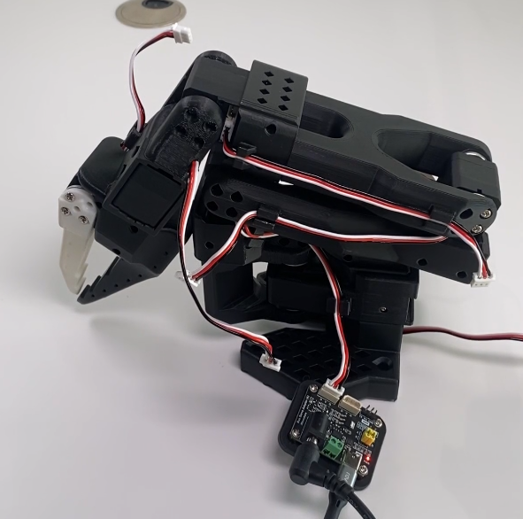|
|**1号舵机编号**|驱动板只接1号关节的舵机||

编号完成之后，再把所有的舵机从末端到底座串联起来


### 手动标定

**拿到组装成品的用户，可以**[**到这里下载标定参数**](https://www.makerobots.cn/calibration)** \(****https://www\.makerobots\.cn/calibration\)****，可以不用再标定。跳过 2\.5 这一步。**


新的标定流程差别：

1. 中位校准，确保每个关节运行过程中都不过0

2. 会自动记录每个关节的最大、最小限位，并设置到舵机固件中，不再因单个关节的卡位而烧坏舵机。


标定指引视频

[https://www.bilibili.com/video/BV1qECYBhEft]()


#### 手动标定Follower臂

运行命令后，首先是 Middle Position，然后是各关节都旋转到最大最小限位。（命令往下翻可以看到，这里先熟悉流程）

|Middle position|命令行窗口输出<br>“Move so101\_follower to the middle of its range of motion and press ENTER\.\.\.\.” <br>之后，机械臂摆成这个样子（动爪朝上，固定爪朝下），再按回车键<br>||
|---|---|---|
|各关节限位|最大张开角度|最小张开角度|
|6号关节|||
|5号关节|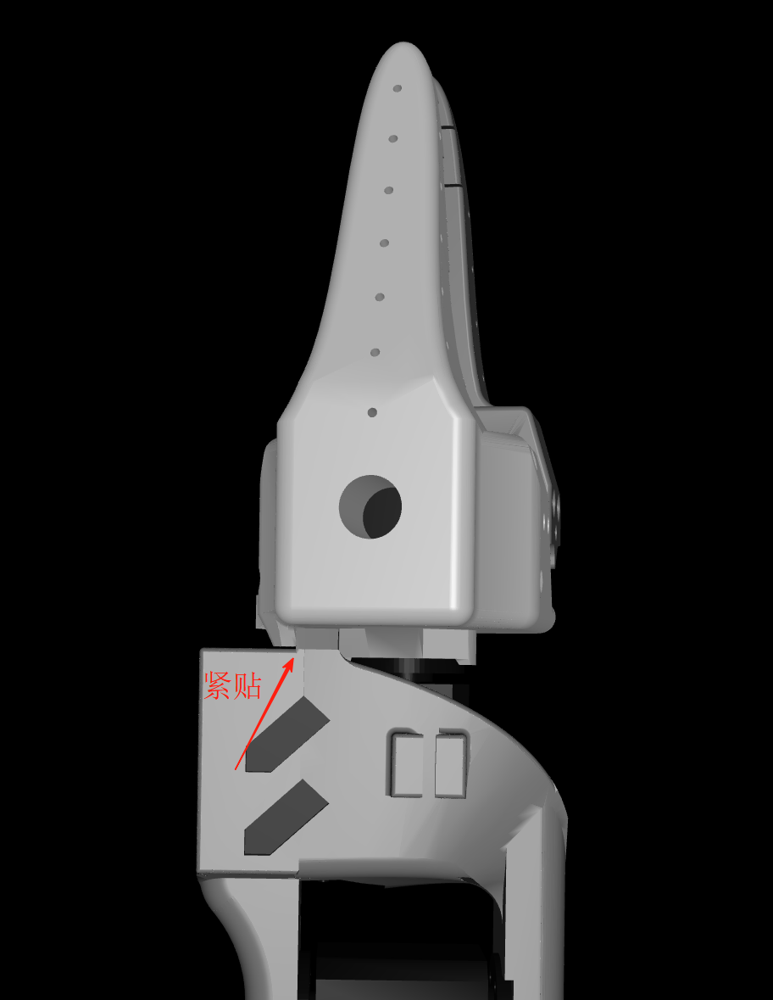|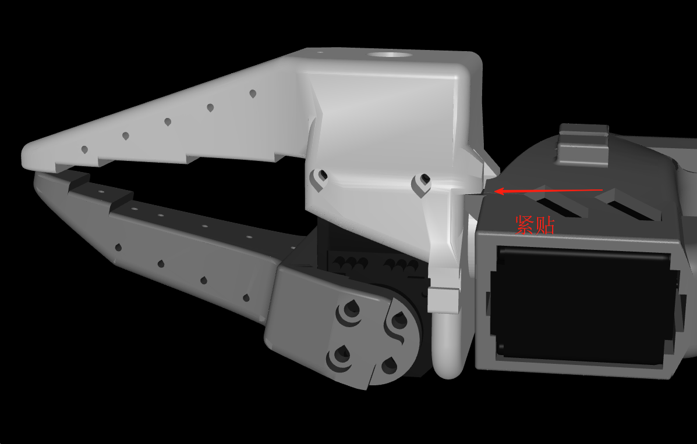<br>|
|4号关节|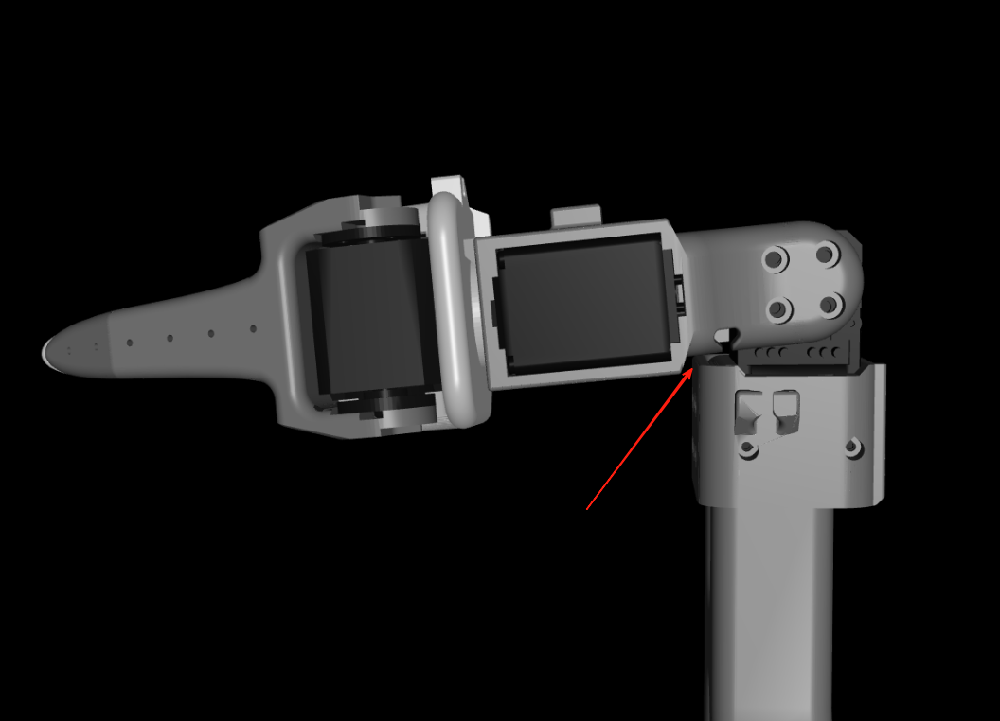||
|3号关节|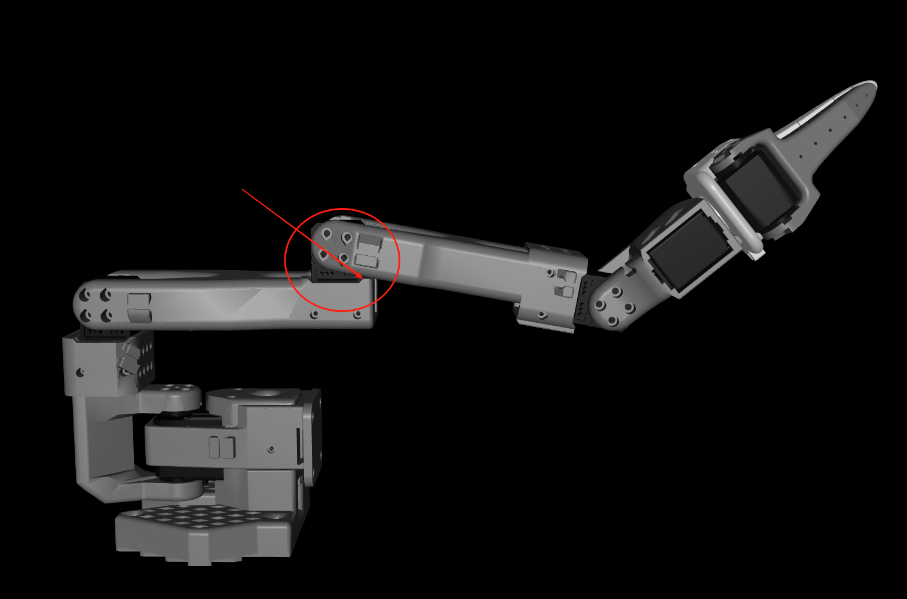|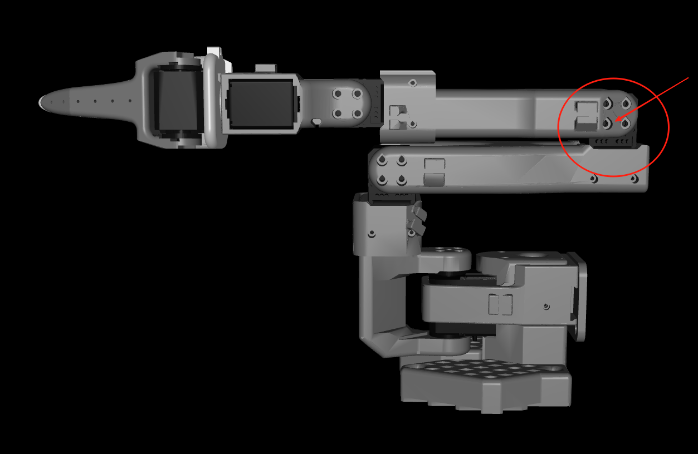|
|2号关节|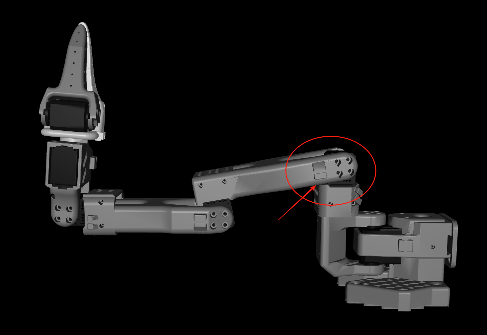|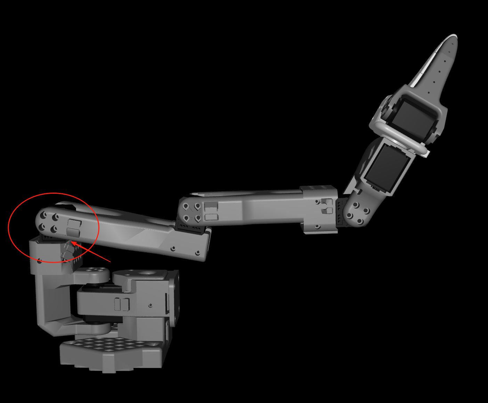|
|1号关节|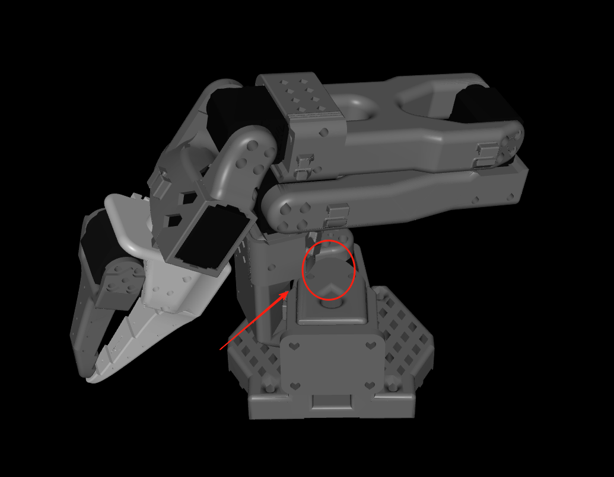|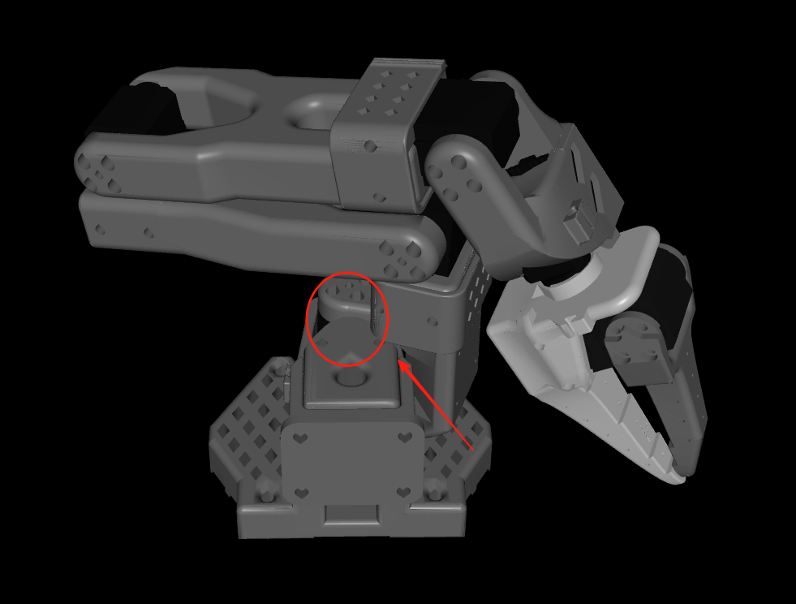|

确保Follower臂连接电源和USB信号线之后，运行以下脚本，按顺序摆弄姿态标定。随着各关节位置的变化，其中的数值会跟着变化。

最终的参数大概在这个范围，当MIN, MAX 达到最终状态不再变化之后，按回车保存。

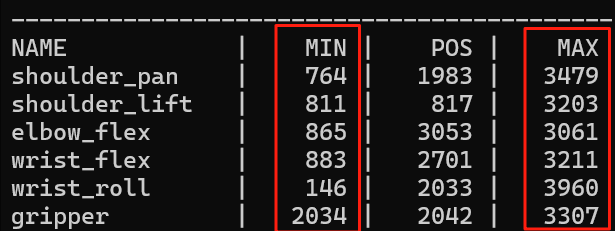


端口号 ACM0/ACM1, COMXX 这些请根据你的实物编号修改。

robot\.id=**R12252801** 也请根据你的实际编号修改，成品发货的编号在底座右侧的标签贴纸上。自己组装的，自己起个ID名字就好了，就叫 my\_awesome\_follower\_arm 之类的。

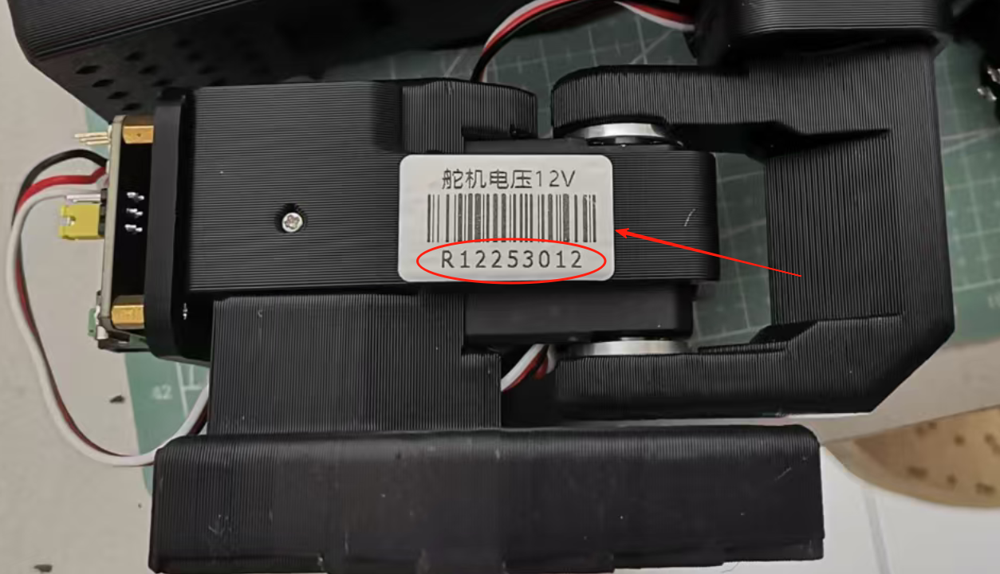

Linux平台，假定串口设备文件为 /dev/ttyACM0

```Shell
python -m lerobot.calibrate \
    --robot.type=so101_follower \
    --robot.port=/dev/ttyACM0 \
    --robot.id=R12252801
```

标定好的参数文件保存为： \~/\.cache/huggingface/lerobot/calibration/robots/so101\_follower/R12252801\.json


Windows平台Powershell执行如下的指令（注意换行符为反引号），假定端口号为 COM3

```PowerShell
python -m lerobot.calibrate `
    --robot.type=so101_follower `
    --robot.port=COM3 `
    --robot.id=R12252801
```

标定好的参数文件保存为： C:\\Users\\$\{USER\_NAME\}\\\.cache\\huggingface\\lerobot\\calibration\\robots\\so101\_follower\\R12252801\.json（$\{USER\_NAME\} 为你的用户名）

#### 手动标定 Leader 臂

运行命令后，首先是 Middle Position，然后是各关节都旋转到最大最小限位。\(张开角度与 Follower 类似）

|Middle position|命令行窗口输出<br>“Move so101\_leader to the middle of its range of motion and press ENTER\.\.\.\.” <br>之后，机械臂摆成这个样子，再按回车键<br>||
|---|---|---|

张开角度的最大最小限位，查看[标定视频](https://tcnppips4y7o.feishu.cn/wiki/FPlmwRDW1i2fdAkJqj1c5zbDnzb#share-V5bfddsRdoBdGCxFmfhcQCsenlb)。


Linux平台，假定串口设备文件为 /dev/ttyACM1。与Follower同样操作后按回车保存。

端口号和 teleop\.id 要根据你的实际情况修改

```Shell
python -m lerobot.calibrate \
    --teleop.type=so101_leader \
    --teleop.port=/dev/ttyACM1 \
    --teleop.id=R07252801
```

标定好的参数文件保存为： \~/\.cache/huggingface/lerobot/calibration/teleoperators/so101\_leader/R07252801\.json


若标定时出现某个关节为负值或者大于4095时，Ctrl\+C 然后断开电源后再插上，重新标定即可。

|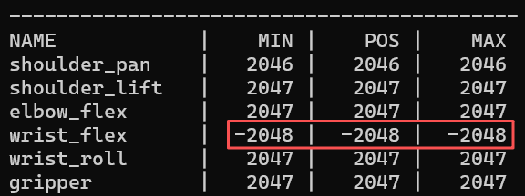|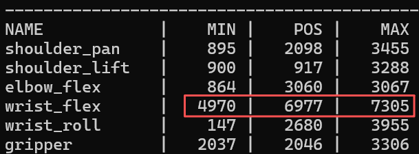|
|---|---|

Windows平台执行如下的指令（注意换行符为反引号），假定端口号为 COM4

```PowerShell
python -m lerobot.calibrate `
    --teleop.type=so101_leader `
    --teleop.port=COM4 `
    --teleop.id=R07252801
```

标定好的参数文件保存为： C:\\Users\\$\{USER\_NAME\}\\\.cache\\huggingface\\lerobot\\calibration\\teleoperators\\so101\_leader\\R07252801\.json（$\{USER\_NAME\} 为你的用户名）

## 遥操作示教

### 遥操作前的标定检查

正式遥操作前，记得检查标定是否准确，特别是自己第一次组装的小伙伴。

参考这个检查的视频，检查第2、3、6号关节在 rest 位置时，是否处于与 Leader 臂同步的状态。如差异很大，可能 Leader 臂处于 rest 位时 follower 扭矩还很大，导致舵机发热、过热。

[https://www.bilibili.com/video/BV1xHMnzMEn2/]()

### 正式遥操作示教

**！！！标定完之后的第一次示教，Follower臂一定要先断电一次！！！（否则有关节卡死，目前原因未知）**

示教动作前，请确保两个臂的姿态一致，最好都处于 rest 位，避免突然的大动作伤及无辜。

**端口号 ACM0/ACM1, COMXX 这些请根据你的实物编号修改。**

**robot\.id 也请根据你的实际编号修改，成品发货的编号在底座右侧的标签贴纸上。**

Linux平台

```Shell
python -m lerobot.teleoperate \
    --robot.type=so101_follower \
    --robot.port=/dev/ttyACM0 \
    --robot.id=R12252801 \
    --teleop.type=so101_leader \
    --teleop.port=/dev/ttyACM1 \
    --teleop.id=R07252801
```

MacOS

```Shell
python -m lerobot.teleoperate \
    --robot.type=so101_follower \
    --robot.port=/dev/tty.usbmodem58760431541 \
    --robot.id=R12252801 \
    --teleop.type=so101_leader \
    --teleop.port=/dev/tty.usbmodem58760431551 \
    --teleop.id=R07252801
```

Windows

```PowerShell
python -m lerobot.teleoperate `
    --robot.type=so101_follower `
    --robot.port=COM28 `
    --robot.id=R12252801 `
    --teleop.type=so101_leader `
    --teleop.port=COM27 `
    --teleop.id=R07252801
```

## 安装相机

### 夹爪相机支架

新款的相机支架做了一些简化，结构强度更高。

|1. 对位相机支架和固定爪上的两个螺丝孔位<br>（记得前面安装时，固定爪内预埋M3螺母）|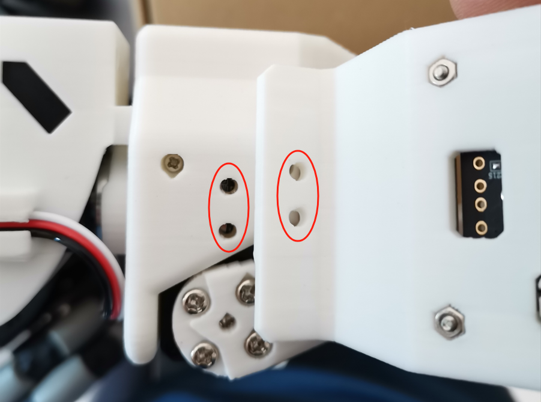|
|---|---|
|2. 对准孔位后||
|3. 用两颗 M3 \* 10的螺钉固定|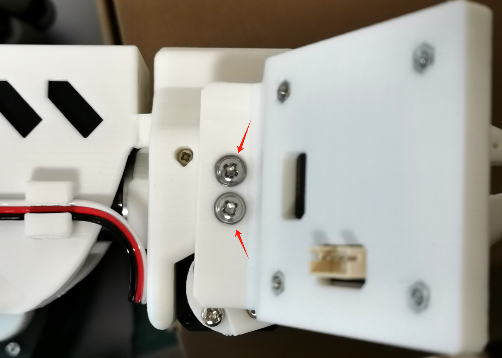|
|4. 安装完成<br>||
|5. 插上背部的数据线端子，注意防呆口的朝向<br>|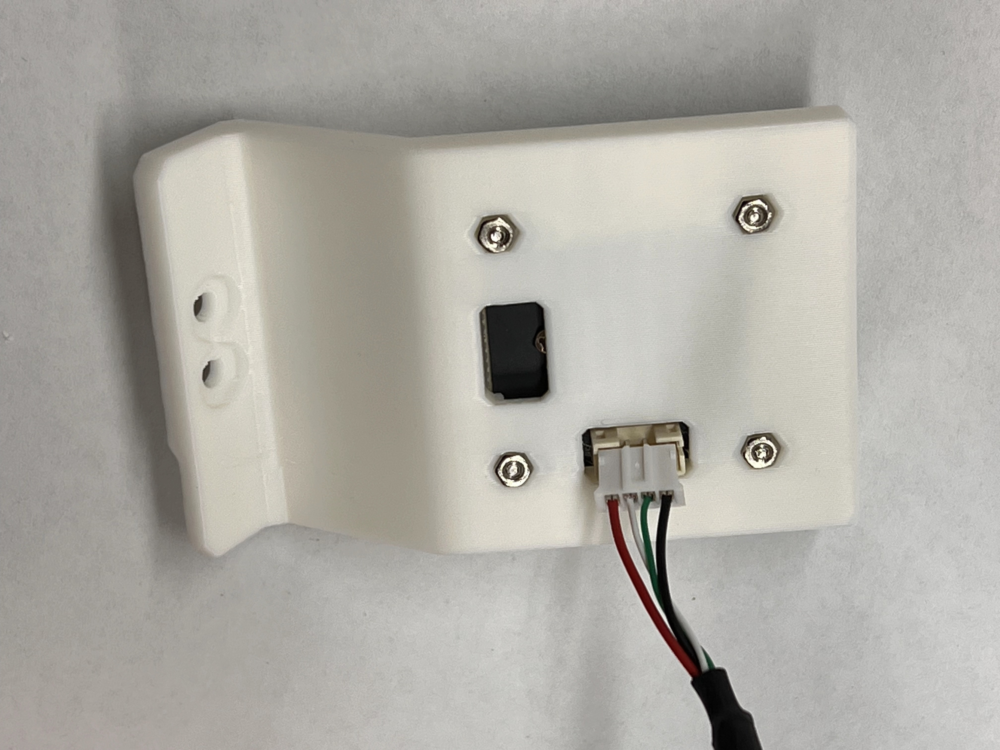|
|6. 数据线的另一端USB Type A，插到电脑的USB Type A口上，或者通过USB Hub连接到电脑的USB口。||

用扎带将USB线绑在机械臂上


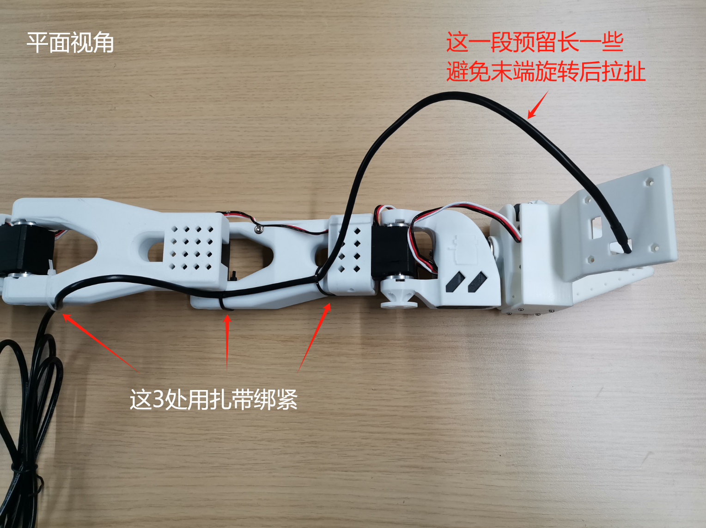


### 固定环境相机

夹具安装

|1. 拆开夹具背后的螺母||
|---|---|
|2. 将螺母先从万向球套入支架末端的支撑柱中||
|3. 夹具尾部套住万向球||
|4. 螺母套住万向球从背后拧紧||
|5. 把相机平板支架夹在夹具上||

相机支架安装

|用扎带将摄像头的USB线捆在支架立柱上|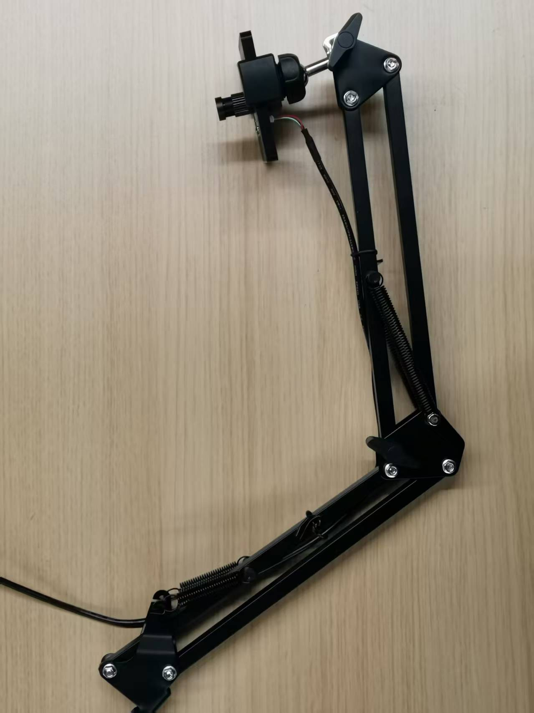|
|---|---|
|支架插入底座上|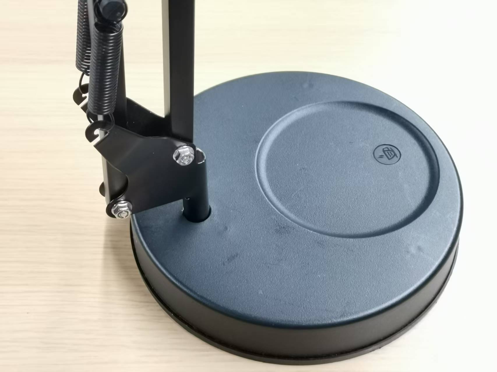|

## 数据采集和训练

### **数据录制**

#### 相机配置

数据录制前确认连接的摄像头序号，执行命令（OpenCV相机就会轮询0\~59，请耐心等待一会）

```Shell
python -m lerobot.find_cameras
```

在插入两个 OpenCV 摄像头的时候，会打印类似下面的内容：


在 lerobot/output/captured\_images 目录下，可以看到 2个获取的图像文件：

|opencv\_\_dev\_video0\.png|从序号为0的相机获取的图像|
|---|---|
|opencv\_\_dev\_video1\.png|从序号为1的相机获取的图像|

通过图像的内容，即可判断序号0、1分别对应的哪个物理相机。


记录摄像头与序号的对应关系，比如（我是说比如，你真实的情况可能不一样）：

0 \-\- 手眼相机 （handeye\)

1 \-\- 固定环境相机 \(fixed\)


注意：插拔或电脑重启之后序列对应关系会发生变化

##### 相机分辨率和FOV

值得注意的是，本产品提供的配套相机，支持以下分辨率和对应的FOV

|分辨率列表|MJPG帧率|FOV|
|---|---|---|
|1280x720<br>640x360|30fps|全FOV，16:9<br>\~对角140度|
|800x600<br>640x480<br>352x288<br>320x240|30fps|裁剪FOV，4:3<br>\~对角110度|

双相机，显存 6GB 以下，建议使用 640x360 或 640x480 分辨率。

1280x720 分辨率直接训练，建议 12GB 以上显存。


##### 相机的编码流设置

为支持同一个HUB上摄像头的更高帧率，修改src\\lerobot\\cameras\\opencv\\camera\_opencv\.py，在设置分辨率长宽之后，添加设置 MJPG 流。

本产品配套的相机，在 MJPG 流模式下才能达到 30fps@640x480。

**克隆我们的仓库代码，则这一部分已经修改好。**

查看这个提交：https://github\.com/JoyandAI/lerobot/commit/b4fd4aab9dfefcaceb46725969994dbcfe97df0b


#### 示教时显示相机画面

添加相机参数和显示参数

端口号 ACM0/ACM1, COMXX 这些请根据你的实物编号修改。

robot\.id=**R12252801** 也请根据你的实际编号修改，成品发货的编号在底座右侧的标签贴纸上；散件组装的自己为robot\.id命名。

```Shell
python -m lerobot.teleoperate \
    --robot.type=so101_follower \
    --robot.port=/dev/ttyACM0 \
    --robot.id=R12252801 \
    --robot.cameras="{ 'handeye': {'type': 'opencv', 'index_or_path': 0, 'width': 640, 'height': 360, 'fps': 30}}" \
    --teleop.type=so101_leader \
    --teleop.port=/dev/ttyACM1 \
    --teleop.id=R07252801 \
    --display_data=true
```

Windows

```PowerShell
python -m lerobot.teleoperate `
    --robot.type=so101_follower `
    --robot.port=COM3 `
    --robot.id=R12252801 `
    --robot.cameras="{ 'handeye': {'type': 'opencv', 'index_or_path': 0, 'width': 640, 'height': 360, 'fps': 30}}" `
    --teleop.type=so101_leader `
    --teleop.port=COM4 `
    --teleop.id=R07252801 `
    --display_data=true
```

#### 本地录制

本地录制比较简单，不用获取Hugging face 的token。

先直接设置 HF\_USER 变量，可以直接设置为你的用户名。

```Plain Text
export HF_USER=your_user_name
```

注意：Windows命令行下使用set命令替代: set HF\_USER=your\_user\_name


正面的命令比较长，可以写到脚本文件中：

Linux  cmd\.sh 或 cmd\.ps1 中以方便重复执行。

再使用 record 命令开始录制（相比 teleoperate，多了后面 \-\-dataset 的三个选项）

端口号 ACM0/ACM1, COMXX 这些请根据你的实物编号修改。

robot\.id=**R12252801** 也请根据你的实际编号修改，成品发货的编号在底座右侧的标签贴纸上；散件组装的自己为robot\.id命名。

```Shell
python -m lerobot.record \
    --robot.disable_torque_on_disconnect=true \
    --robot.type=so101_follower \
    --robot.port=/dev/ttyACM0 \
    --robot.id=R12252801 \
    --robot.cameras="{'handeye': {'type': 'opencv', 'index_or_path': 0, 'width': 640, 'height': 360, 'fps': 30}, 'fixed': {'type': 'opencv', 'index_or_path': 2, 'width': 640, 'height': 360, 'fps': 30}}" \
    --teleop.type=so101_leader \
    --teleop.port=/dev/ttyACM1 \
    --teleop.id=R07252801 \
    --display_data=true \
    --dataset.repo_id=${HF_USER}/so101_test \
    --dataset.num_episodes=10 --dataset.episode_time_s=20 \
    --dataset.single_task="Grab the black cube"
```

只有一个摄像头时，camera参数部分为：\-\-robot\.cameras="\{'handeye': \{'type':'opencv', 'index\_or\_path':0, 'width':640, 'height':360, 'fps':30\}\}


注意第2次录制时，使用相同的 dataset\.repo\_id 参数会报 **File exists** 错误。要么 dataset\.repo\_id 换名字，要么删除原来的，要么加 “\-\-resume=true” 继续录制到该数据集。


Windows Powershell 下命令（使用反引号 \` 作为命令换行符）

端口号 ACM0/ACM1, COMXX 这些请根据你的实物编号修改。

robot\.id=**R12252801** 也请根据你的实际编号修改，成品发货的编号在底座右侧的标签贴纸上；散件组装的自己为robot\.id命名。

```PowerShell
python -m lerobot.record `
    --robot.disable_torque_on_disconnect=true `
    --robot.type=so101_follower `
    --robot.port=COM4 `
    --robot.id=R12252801 `
    --robot.cameras="{'handeye': {'type': 'opencv', 'index_or_path': 0, 'width': 640, 'height': 360, 'fps': 30}, 'fixed': {'type': 'opencv', 'index_or_path': 1, 'width': 640, 'height': 360, 'fps': 30}}" `
    --teleop.type=so101_leader `
    --teleop.port=COM3 `
    --teleop.id=R07252801 `
    --display_data=true `
    --dataset.repo_id=${HF_USER}/so101_test `
    --dataset.num_episodes=10 --dataset.episode_time_s=20 `
    --dataset.single_task="Grab the black cube"
```

如果要继续上一次的录制，可以添加：“ \-\-resume=true ”

参数解释：

|参数|解释|设置建议|
|---|---|---|
|**dataset\.num\_episodes**|动作重复的次数||
|**dataset\.episode\_time\_s**|整个任务的周期，以秒为单位|默认为60，根据完成任务所需时间的长短来设置|
|**dataset\.reset\_time\_s**|执行完任务后场景恢复到初始状态所需的时间，以秒为单位|默认为60，如果场景恢复很快，可以设置短一些，比如5秒。<br>如果场景很复杂，涉及多件物品的复位，则需要设置得长一些|
|**dataset\.push\_to\_hub=false**|不往Hugging face传送数据||

每次动作的结束以两种方式：

1. 计时到 episode\_time\_s

2. 如果动作已完成，按键盘向右键提前结束当前轮次

3. 按键盘向左键重录当前轮次

4. 按ESC退出录制


#### 基本流程

1. 手动操作主臂完成目标动作（如抓取杯子）  

2. 从臂通过摄像头同步记录动作轨迹  

3. 建议先采集10组左右跑通整个流程，需要更好的效果再采集更多组（比如≥50）组动作序列。 


### **训练配置** 

推荐新手使用ACT，由 "\-\-policy\.type=act" 指定训练的策略为ACT。

其他可选择的策略：

- act, Action Chunking Transformers

- diffusion, Diffusion Policy

- tdmpc, TDMPC Policy

- vqbet, VQ\-BeT

- smolvla, SmolVLA

- pi0, A Vision\-Language\-Action Flow Model for General Robot Control

- pi0\-fast

- sac

- reward\_classifier

本地训练，不上传模型时添加选项“\-\-policy\.push\_to\_hub=false”

```Shell
python -m lerobot.scripts.train \
  --dataset.repo_id=${HF_USER}/so101_test \
  --policy.type=act \
  --output_dir=outputs/train/act_so101_test \
  --job_name=act_so101_test \
  --policy.device=cuda \
  --policy.push_to_hub=false \
  --wandb.enable=false
```


等到打印如下日志时，表明训练已经开始

> INFO 2025\-03\-01 21:03:07 ts/train\.py:232 step:100 smpl:800 ep:3 epch:0\.67 loss:4\.547 grdn:131\.117 lr:1\.0e\-05 updt s:0\.297 data s:0\.000
> 
> INFO 2025\-03\-01 21:03:13 ts/train\.py:232 step:120 smpl:960 ep:4 epch:0\.80 loss:4\.117 grdn:115\.125 lr:1\.0e\-05 updt s:0\.296 data s:0\.000
> 
> INFO 2025\-03\-01 21:03:18 ts/train\.py:232 step:140 smpl:1K ep:5 epch:0\.93 1oss:3\.772 grdn:106\.575 lr:1\.0e\-05 updt s:0\.296 data s:0\.000
> 
> 


*10组数据，3090显卡训练约需2小时*  


继续之前中断的训练，可以使用下面的命令：

```Shell
python ./src/lerobot/scripts/train.py \
  --config_path=outputs/train/act_so101_test/checkpoints/last/pretrained_model/train_config.json \
  --resume=true
```

#### SmolVLA训练

先安装相关依赖包

```Bash
pip install -e ".[smolvla]"
```

大陆用户，设置Huggingface的国内镜像：

```Bash
export HF_ENDPOINT=https://hf-mirror.com
```

训练命令

```Bash
python src/lerobot/scripts/train.py \
  --dataset.repo_id=${HF_USER}/so101_test --policy.push_to_hub=false \
  --policy.path=lerobot/smolvla_base --policy.device=cuda \
  --output_dir=outputs/train/smolvla_test \
  --job_name=smolvla_test \
  --batch_size=64 --steps=20000 \
  --wandb.enable=false
```

如果报显存不足的错误，请减小batch\_size。如果显存只有8GB，batch\_size 最好设置在28以内。


如果需要上传到huggingface，则选项 policy\.push\_to\_hub 修改为 “\-\-policy\.push\_to\_hub=true”


#### 5\.2\.2 云端训练

参考此篇文档[云服务器训练教程](https://tcnppips4y7o.feishu.cn/wiki/QpMJwL7VqiSo40k8HPRcPqK0n6e?fromScene=spaceOverview)

## **模型测试**

### **实时推理测试** 

Ubuntu/MacOS命令 （*注意，这里仍然用的是 record\.py，是**推理的同时记录数据集**，可能huggingface希望大家把数据集都上传到HF。但提供了 policy，**确实是用指定策略模型推理*）

```Bash
python -m lerobot.record  \
  --robot.type=so101_follower --robot.port=/dev/ttyACM0 --robot.id=R12252801 \
  --teleop.type=so101_leader --teleop.port=/dev/ttyACM1 --teleop.id=R07252801 \
  --robot.disable_torque_on_disconnect=true \
  --robot.cameras="{'handeye': {'type': 'opencv', 'index_or_path': 0, 'width': 640, 'height': 360, 'fps': 30}, 'fixed': {'type': 'opencv', 'index_or_path': 1, 'width': 640, 'height': 360, 'fps': 30}}" \
  --display_data=true \
  --dataset.single_task="Put lego brick into the transparent box" \
  --policy.path=outputs/train/act_so101_test/checkpoints/last/pretrained_model \
  --policy.device=cuda \
  --dataset.repo_id=${HF_USER}/eval_so101 --dataset.push_to_hub=false
```

如果需要上传到huggingface，则选项 dataset\.push\_to\_hub 修改为 “\-\-dataset\.push\_to\_hub=true”

### **推理时常见问题**

**机械臂抖动**：

- 调节 src\\lerobot\\robots\\so101\_follower\\so101\_follower\.py 中 set\_so100\_robot\_preset\(\)函数中的 D\_Coefficient 参数，改得小一点，比如0。

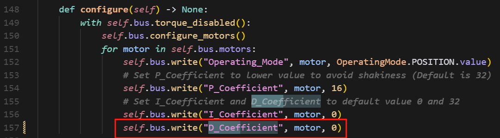

- 检查舵机供电（7\.4V从臂需2A以上电源，12V从臂需2A以上电源）  

**动作偏移**：重新校准关节零点

**训练失败**：减少`batch_size`或增加数据集多样性  


## 进阶之双臂

### 如何组双臂？

组双臂要重新定义机器人类型，以 SO\-ARM101为例，已经添加的双臂机器人类型为 bi\_so101\_follower，遥操作双手为 bi\_so101\_leader。


我们的仓库已经添加双手操作的机器人设置，请pull最新的commit。


### 标定

单臂仍按照 robot\.type=so101\_follower 和 teleop\.type=so101\_leader 的方式标定，确保标定参数按以下规则保存：

1. Follower，参数保存在 \~/\.cache/huggingface/lerobot/calibration/robots/so101\_follower 目录下

2. Leader，参数保存在 \~/\.cache/huggingface/lerobot/calibration/teleoperators/so101\_leader 目录下

### 遥操作

Linux平台下显示实时摄像头数据的遥操作（红色部分根据实际情况修改，一定要注意端口号与实物的对应关系，否则可能报offset mismatch的错误）

```Bash
python -m lerobot.teleoperate \
  --robot.type=bi_so101_follower \
  --robot.left_arm_port=/dev/ttyACM0 \
  --robot.right_arm_port=/dev/ttyACM1 \
  --robot.left_id=R12253101 --robot.right_id=R12253102 \
  --robot.cameras='{
    left: {"type": "opencv", "index_or_path": 0, "width": 1280, "height": 720, "fps": 30},
    top: {"type": "opencv", "index_or_path": 2, "width": 1280, "height": 720, "fps": 30},
    right: {"type": "opencv", "index_or_path": 4, "width": 1280, "height": 720, "fps": 30}
  }' \
  --teleop.type=bi_so101_leader \
  --teleop.left_arm_port=/dev/ttyACM2 \
  --teleop.right_arm_port=/dev/ttyACM3 \
  --teleop.left_id=R07253101 --teleop.right_id=R07253102 \
  --display_data=true
```

Windows平台下，不显示摄像头数据的遥操作（红色部分根据实际情况修改，一定要注意端口号与实物的对应关系，否则可能报offset mismatch的错误）

```Bash
python -m lerobot.teleoperate `
  --robot.type=bi_so101_follower `
  --robot.left_arm_port=COM74 `
  --robot.right_arm_port=COM8 `
  --robot.left_id=R12253101 --robot.right_id=R12253102 `
  --teleop.type=bi_so101_leader `
  --teleop.left_arm_port=COM6 `
  --teleop.right_arm_port=COM69 `
  --teleop.left_id=R07253101 --teleop.right_id=R07253102
```


### 录制数据

Linux平台下遥操作的同时显示实时数据并录制（红色部分根据实际情况修改，一定要注意端口号与实物的对应关系，否则可能报offset mismatch的错误）

```Bash
python -m lerobot.record \
  --robot.type=bi_so101_follower \
  --robot.left_arm_port=/dev/ttyACM0 \
  --robot.right_arm_port=/dev/ttyACM1 \
  --robot.left_id=R12253101 --robot.right_id=R12253102 \
  --robot.cameras='{
    left: {"type": "opencv", "index_or_path": 0, "width": 1280, "height": 720, "fps": 30},
    top: {"type": "opencv", "index_or_path": 2, "width": 1280, "height": 720, "fps": 30},
    right: {"type": "opencv", "index_or_path": 4, "width": 1280, "height": 720, "fps": 30}
  }' \
  --teleop.type=bi_so101_leader \
  --teleop.left_arm_port=/dev/ttyACM2 \
  --teleop.right_arm_port=/dev/ttyACM3 \
  --teleop.left_id=R07253101 --teleop.right_id=R07253102 \
  --display_data=true \
  --dataset.repo_id=USER_NAME/bimanual-so101-test --dataset.push_to_hub=false \
  --dataset.num_episodes=10 \
  --dataset.single_task="Task description"
```

\-\-dataset\.push\_to\_hub=false，指明本地录制，需要上传HuggingFace时，删除该选项，并设置正确的 dataset\.repo\_id。

### 训练

与单臂的训练无差别

### 推理

推理的同时记录数据集，由 policy\.path 参数指定训练好用于推理的模型

```Bash
python -m lerobot.record \
  --robot.type=bi_so101_follower \
  --robot.disable_torque_on_disconnect=true \
  --robot.left_arm_port=/dev/ttyACM0 \
  --robot.right_arm_port=/dev/ttyACM1 \
  --robot.left_id=R12253101 --robot.right_id=R12253102 \
  --robot.cameras='{
    left: {"type": "opencv", "index_or_path": 0, "width": 1280, "height": 720, "fps": 30},
    top: {"type": "opencv", "index_or_path": 2, "width": 1280, "height": 720, "fps": 30},
    right: {"type": "opencv", "index_or_path": 4, "width": 1280, "height": 720, "fps": 30}
  }' \
  --display_data=true \
  --dataset.push_to_hub=false \
  --dataset.num_episodes=10 \
  --dataset.single_task="Task description" \
  --policy.path=outputs/train/act_biso101_test/checkpoints/last/pretrained_model \
  --policy.device=cuda \
  --dataset.repo_id=USER_NAME/eval-biso101-test
```

## 


