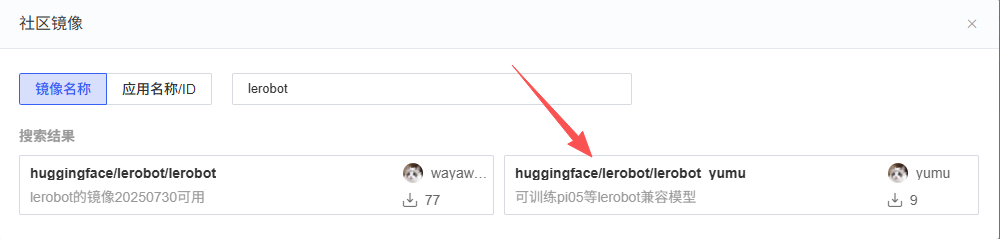
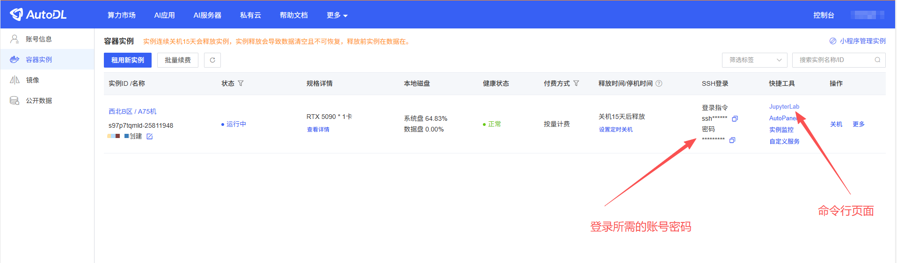
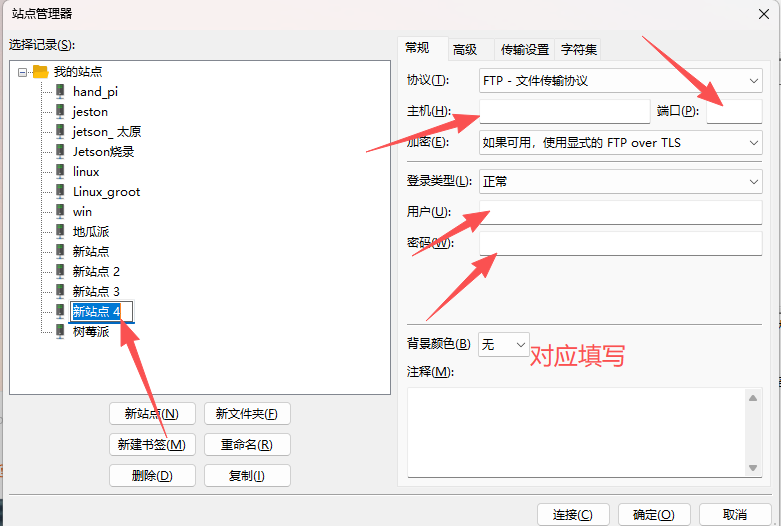

# 云服务器训练教程

### 声明

本文档仅为云端服务器租赁教程，具体平台可自行选择，我们这里选择的是AutoDL平台。官方文档可以参考：[AutoDL官方文档](https://www.autodl.com/docs/)。我们这里以Lerobot采集了10条训练数据，**在ACT模型下用RTX5090训练为例，训练用时为大约2h**。

### 1\. 云服务器租赁

[AutoDL官网](https://www.autodl.com/home)注册账号后，进行GPU的选择。根据个人的数据集的大小、训练的模型来进行GPU的租赁。

租赁的时候可以选择不同的地区，本身没有什么差别，哪里有卡就选哪个区，一般情况下GPU数量选择1就足够了。


选择社区镜像，找到lerobot的镜像。




或者基础镜像中选择2\.70的pytorch和12\.8的CUDA。然后创建并开机软件


### 云服务器登录

建议先选择“**无卡模式**”启动虚拟机，这样可以节省一定的费用。无卡模式下，虽然没有显卡资源，但仍然可以进行代码上传、环境配置等操作。


在AutoDL中可以直接点击JupyterLab进入终端页面，也可以选择SSH登录。SSH登录指令为：

```Shell
ssh -p 端口号 用户名@主机IP
```



### 训练准备阶段


- **官方学术资源加速**

```Shell
source /etc/network_turbo
```

- **下载代码**

    /root/autodl\.tmp盘会在关机15天后清空，但加载速度会偏快，可以把代码clone到这个文件夹。也可以直接在root下clone

    ```Bash
    **git clone ****https://github.com/JoyandAI/lerobot.git**** /autodl-tmp**
    ```


- **安装FileZilla**

    [FileZilla官网](https://filezilla-project.org/)

    - Windows：

    [FileZilla\_3\.69\.5\_win64\_sponsored2\-setup\.exe](图片和附件/FileZilla_3.69.5_win64_sponsored2-setup.exe)

    - MacOS：

    [FileZilla\_3\.69\.5\_macos\-arm64\.app\.tar\.bz2](图片和附件/FileZilla_3.69.5_macos-arm64.app.tar.bz2)

    - Linux：

    安装完后输入filezilla打开

    ```Shell
    sudo apt install filezilla
    ```

- **环境配置**

左上角点击：文件\(File\)\-\>站点管理器\(File manager\)\-\>新站点\(new site\)。协议选择SFTP，用户名填写root，其余根据个人服务器情况进行填写。



- **上传数据**

数据放到\./cache/huggingface/lerobot下

HF\_HOME参数可以设置你当前的总缓存目录，在autodl中/autodl\-tmp文件的读取速度和空间会更大一点，建议做好设置

```Bash
cd ~
mkdir ./autodl-tmp/huggingface
export HF_HOME=./autodl-tmp/huggingface # 如果改完这个之后，数据就需要放到./autodl-tmp/huggingface/lerobot下
```

在/autodl\-tmp/huggingface/** **下，创建项目名称的文件夹。本文训练的为lerobot，则创建lerobot文件（xlerobot也是一样的），将数据放到lerobot文件夹之下。本地文件夹可以直接拖拽上传。

### 训练模型

搭建基本依赖环境，然后进入lerobot文件夹

```Shell
conda activate lerobot
cd /root/autodl.tmp/lerobot
pip instsall -e .
cd ./src # 如果是0.4以上则不需要打这个指令
```

$\{HF\_USER\}更改为你的数据集名称，policy\.type为可选模型，建议选择ACT。在该默认配置下，batch\_size=32，step=100000。

训练过程中可以通过**AutoPanel**查看GPU的使用情况和性能监控，确保你的训练进程顺利进行。训练完记得下载训练完的模型文件到本地电脑

```Bash
python -m lerobot.scripts.train \
  --dataset.repo_id=${HF_USER}/so101_test \
  --policy.type=act \
  --output_dir=outputs/train/act_so101_test \
  --job_name=act_so101_test \
  --policy.device=cuda \
  --policy.push_to_hub=false \
  --wandb.enable=false  
 
 # 0.4即以上代码
lerobot-train \
  --dataset.repo_id=${HF_USER}/so101_test \
  --policy.type=act \
  --output_dir=outputs/train/act_so101_test \
  --job_name=act_so101_test \
  --policy.device=cuda \
  --policy.push_to_hub=false \
  --wandb.enable=false  
```


其他可选择的策略：

有些模型需要单独安装依赖，回到 \.\./lerobot 目录下

- act, Action Chunking Transformers

- diffusion, Diffusion Policy

- tdmpc, TDMPC Policy

- vqbet, VQ\-BeT

- smolvla, SmolVLA

    ```Bash
    pip install -e ".[smolvla]"
    ```

- pi0, A Vision\-Language\-Action Flow Model for General Robot Control

    ```Shell
    pip install -e ".[pi]"
    ```

- pi0\-fast

    ```Shell
    pip install -e ".[pi]"
    ```

- sac

- reward\_classifier


